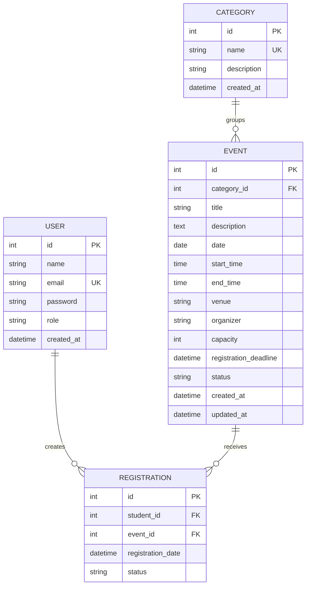

# CampusPulse ER Diagram

```mermaid
erDiagram
    USER ||--o{ REGISTRATION : creates
    EVENT ||--o{ REGISTRATION : receives
    CATEGORY ||--o{ EVENT : groups

    USER {
        int id PK
        string name
        string email UK
        string password
        string role
        datetime created_at
    }
    CATEGORY {
        int id PK
        string name UK
        string description
        datetime created_at
    }
    EVENT {
        int id PK
        int category_id FK
        string title
        text description
        date date
        time start_time
        time end_time
        string venue
        string organizer
        int capacity
        datetime registration_deadline
        string status
        datetime created_at
        datetime updated_at
    }
    REGISTRATION {
        int id PK
        int student_id FK
        int event_id FK
        datetime registration_date
        string status
    }
```

`REGISTRATION(student_id, event_id)` is unique at the database level.